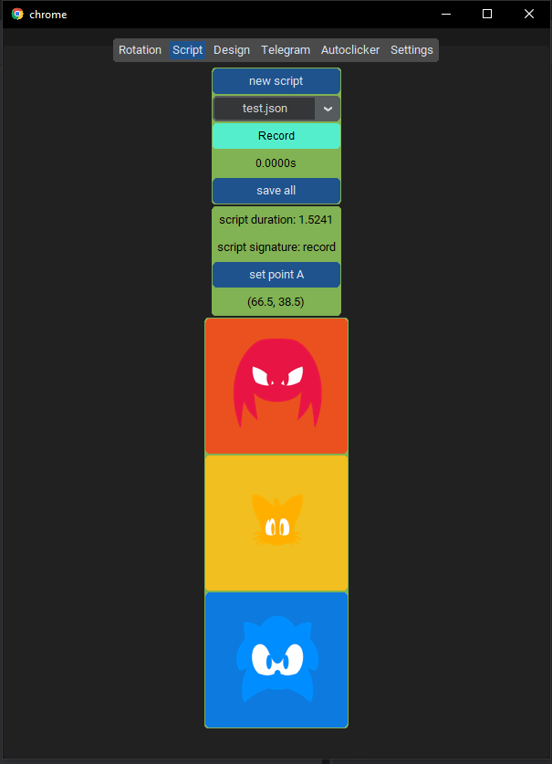
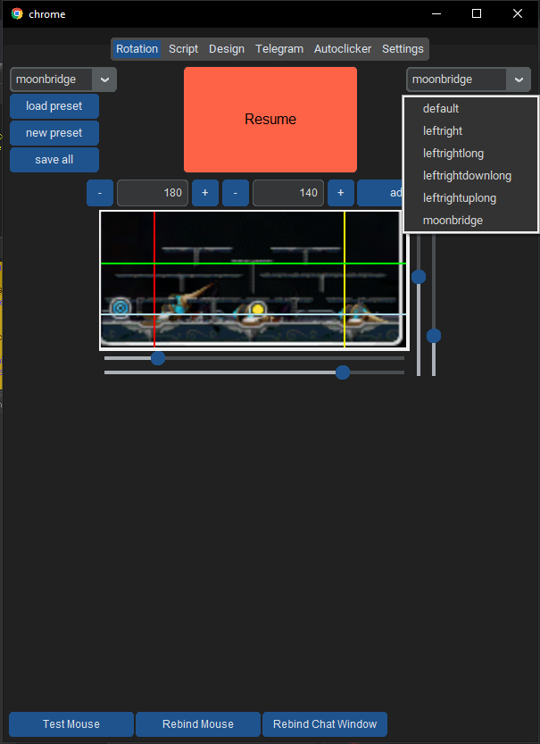

# Description: 
Bumblebee Bot is a custom bot for the 2D MMORPG game - MapleStory.  
This bot does not trigger in-game lie detector in MapleSEA (tested), however not tested in other region MS / private server. 
It is open sourced and free to use. 

Bumblebee Bot 是专为2D MMORPG 游戏《楓之谷》定制的脚本。
该脚本在《楓之谷》东南亚服务器（经过测试）（MapleStorySEA）中不会触发游戏内的测谎仪，但在其他地区的《楓之谷》或私人服务器上未经测试。
该外挂是开源的，并且免费使用。

（Translated）Bumblebee Bot은 2D MMORPG 게임 '메이플스토리'를 위해 맞춤으로 개발된 외부 도구입니다. 이 도구는 '메이플스토리' 동남아 서버(MapleStorySEA)에서 내장된 거짓탐지기를 작동시키지 않습니다(테스트 완료). 그러나 다른 지역의 '메이플스토리'나 사설 서버에서는 테스트되지 않았습니다. 이 도구는 오픈 소스이며 무료로 사용할 수 있습니다.

# Updates:
- 12th April 2024: Added script recording method. Join discord to read on how to use. With this feature update, all major features have been implemented. Feel free to play with the bot. Feel free to ask questions in the discord to learn how to use / how to design your own custom rotation, etc. Next update will be some QoL, bug fixing, code cleaning, redesigning ui, and more. 

- 10th April 2024: Can now select map preset (left) and action function (right). 

- 31st March 2024: Now possible to write high efficiency custom rotation. Tutorial on how to write custom rotation is in discord. Video showcase is available in discord. 
- 29th March 2024: GMA detector. (need external chat window)

# Bot Limitations:
- Polo portal / Especia portal currently doesn't work on DMT day as the banner is blocking the top timer used to differentiate portal type. Users are suggested to turn portal feature off in settings tab. 
- When launcing on multiple PCs, cannot use the same telegram bot, must create a new tg bot for each PC. 

# Quick Installation:
1. install python 3.12 (https://www.python.org/ftp/python/3.12.0/python-3.12.0-amd64.exe)
2. install interception (https://github.com/oblitum/Interception)
3. create a new folder somewhere (preferably desktop)
4. run cmd (administrator) --> `cd C:\Users\myusername\Desktop\myfoldername`
5. `git clone https://github.com/agumonlyt/Bumblebee`
6. `cd Bumblebee`
7. `pip install -r requirements.txt`
8. `python main.py`

# Discord Link: 
https://discord.gg/dbsKm2jE27

# Disclaimer:
We do not encourage botting. This project is only for research purpose. 

# Credits:
Part of the code taken from:
- https://github.com/qlvbrknp/maple-bot
- https://github.com/kennyhml/pyinterception

# Bot Showcase:
- soul master custom rotation at limen 1-7

more videos in the making. join discord server for more showcasing. 